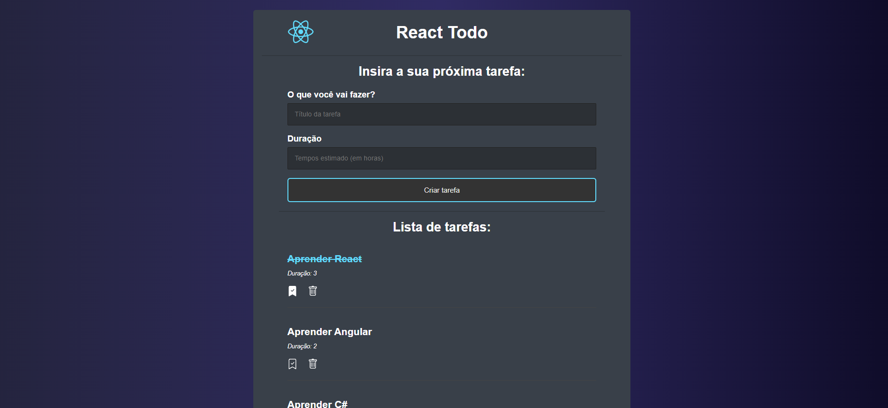
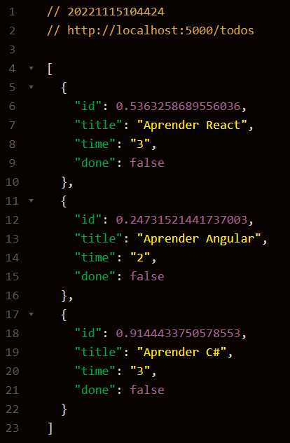

# ToDo - Agenda de tarefas com React

O projeto consiste em uma agenda de tarefas onde é possível criar uma nova tarefa com o nome da task e a duração que imagina concluí-la. Também tem a funcionalidade de marcar como concluida e excluir

Foi desenvolvido usando o React e o Json Serve para poder funcionar como se fosse uma API vindo de uma banco de dados.

## Imagens

|Layout|API - Json- Server|
|---|---|
| | 

## 🚀 Começando

Pra começar, primeiro clone o repositório do projeto pra sua máquina

```
$ git clone https://github.com/Vinicius-Rubia/ToDo-React.git
```

## ⚙️ Executando a aplicação

Para iniciar a aplicação, execute em seu terminal:

```
$ npm install -> Instalar todas as dependências
```

```
$ npm run server -> Iniciar o Json Serve para inicializar a API
```

```
$ npm start -> Inicia a aplicação em http://localhost:3000
```

Se quiser conferir a API do Json Server funcionando acesse http://localhost:5000/todos